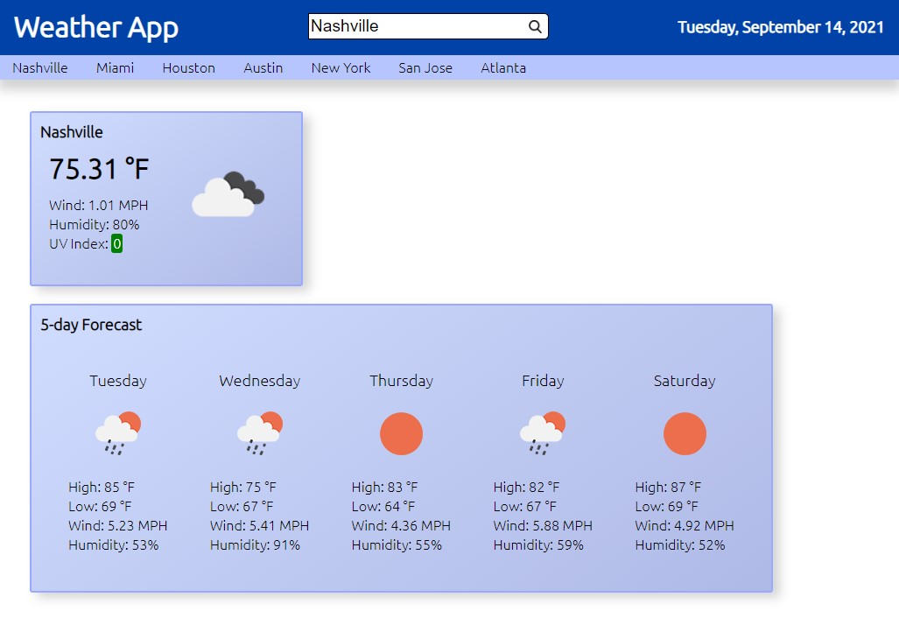

# Weather-Dashboard
A web application that allows users to look up current weather and a 5 day forecast in any city.

## Usage
The website is hosted on GitHub pages and can be accessed [here](https://jkohrt7.github.io/Weather-Dashboard/).

At the top of the page, a search bar lets users look up any city to view the current weather and forecast for that area.
The weather data is retrieved using a free version of the [OpenWeather API](https://openweathermap.org/); in order to prevent users from going over the number of permitted requests, only one search per second is possible.

Cities that have been searched in the past will appear in the subheader; clicking these will automatically launch a query for that city.

## Credits
 - [OpenWeather API](https://openweathermap.org/)

## License
[MIT](LICENSE)